# Decentralized Autonomous Civilization - Design Document

## Problem Statement

Existing AI agent systems face several critical challenges:

1. **Lack of Trust**: No verifiable way to ensure AI computations are executed correctly and securely
2. **Centralization**: AI infrastructure is controlled by centralized entities, creating single points of failure and censorship
3. **Payment Friction**: No standardized, automated payment mechanism for compute resources in AI agent systems
4. **No Provenance**: Difficulty in tracking and verifying the full execution history of AI tasks
5. **Resource Allocation**: Inefficient matching of compute resources with AI workloads

## Requirements

### Functional Requirements

1. **Network Initialization**
   - Authority can initialize network with approved TEE code measurements and network configuration
   - Pre-allocation of goal and task slots for efficient resource management

2. **Node Management**
   - Validator nodes must prove genuine Intel SGX hardware through attestation
   - Compute nodes must pass benchmark validation before accepting tasks
   - Real-time node status tracking and event subscription

3. **Agent Management**
   - Agents must be validated before becoming active
   - Agent configuration stored off-chain (IPFS) with on-chain CID references
   - Agent memory state persistence across task executions

4. **Goal & Task Execution**
   - Goals define objectives with iteration limits and treasury funding
   - Tasks are pre-allocated and reused across goal iterations
   - Compute nodes claim and execute tasks using LLM
   - Validators verify task execution and determine completion

5. **Payment System**
   - Each goal has an associated treasury PDA
   - Payments automatically transferred upon successful validation
   - Treasury balance checks before task creation
   - Support for contributions to goal treasuries

### Non-Functional Requirements

1. **Security**
   - All validator operations must run in Intel SGX TEE
   - TEE attestation required for validator registration
   - Code measurement whitelist enforcement
   - Cryptographic signatures for all validations
   - SHA256 chain proofs for data integrity

2. **Performance**
   - Event-driven architecture using Solana account subscriptions
   - Off-chain data storage (IPFS) to minimize on-chain state
   - Pre-allocated task slots to avoid repeated account creation

3. **Scalability**
   - Support for multiple validators and compute nodes
   - Configurable task and goal allocation limits
   - Reusable task accounts across goal iterations

4. **Reliability**
   - Task retry mechanism for failed executions
   - Node status tracking (Active/Disabled/Rejected)
   - Treasury balance validation before task creation

## Design

### Architecture Overview

The system follows a modular architecture with three main layers:

1. **On-Chain Layer (Solana Smart Contract)**
   - Manages all account state and transitions
   - Enforces security rules and payment logic
   - Provides event notifications via account changes

2. **Off-Chain Storage (IPFS)**
   - Stores agent configurations, memory state, and task data
   - Only CIDs stored on-chain for data integrity

3. **Node Layer**
   - **Validator Nodes**: Run in TEE, validate tasks, determine payments
   - **Compute Nodes**: Execute tasks using LLM, submit results

### Key Design Decisions

1. **Pre-Allocated Task Slots**: Tasks are created during network initialization and reused, avoiding repeated account creation overhead

2. **Event-Driven Architecture**: Nodes subscribe to Solana account changes for real-time notifications, eliminating polling

3. **Separation of Concerns**: Task execution (Compute Nodes) is separate from validation (Validator Nodes)

4. **TEE-Only Validation**: Only validators with proven TEE hardware can validate tasks and determine payments

5. **Treasury-Per-Goal**: Each goal has its own treasury PDA for isolated payment management

### Data Flow

1. **Goal Creation**: Owner creates goal → deposits initial funds → selects agent
2. **Task Assignment**: Available task moved from Ready → Pending when assigned to goal
3. **Task Execution**: Compute node claims task → executes with LLM → submits result
4. **Validation**: Validator verifies result → signs validation → triggers payment
5. **Iteration**: If goal not complete, task returns to Pending; otherwise, task returns to Ready

## Architecture Specification

### NetworkConfig

Global network configuration account that tracks system-wide statistics and approved code measurements. This is the root account initialized once during network setup.

The NetworkConfig PDA stores:
- `netowrk_config_cid`: IPFS CID of network configuration
- `agent_count`: Current number of registered agents
- `goal_count`: Current number of goals
- `task_count`: Current number of tasks
- `validator_node_count`: Current number of active validator nodes
- `compute_node_count`: Current number of active compute nodes
- `approved_code_measurements`: Vector of approved TEE code measurements (max 10)
  - Each entry contains: `measurement` (32 bytes) and `version` (semantic version: major.minor.patch)
  - Newest measurements are always at the beginning (index 0)
  - When adding a new measurement and vector is full, oldest measurement is removed
  - Versions use semantic versioning (major: u16, minor: u16, patch: u16)
- `bump`: NetworkConfig PDA bump seed

Seeds: `["network_config"]`

#### Sequence

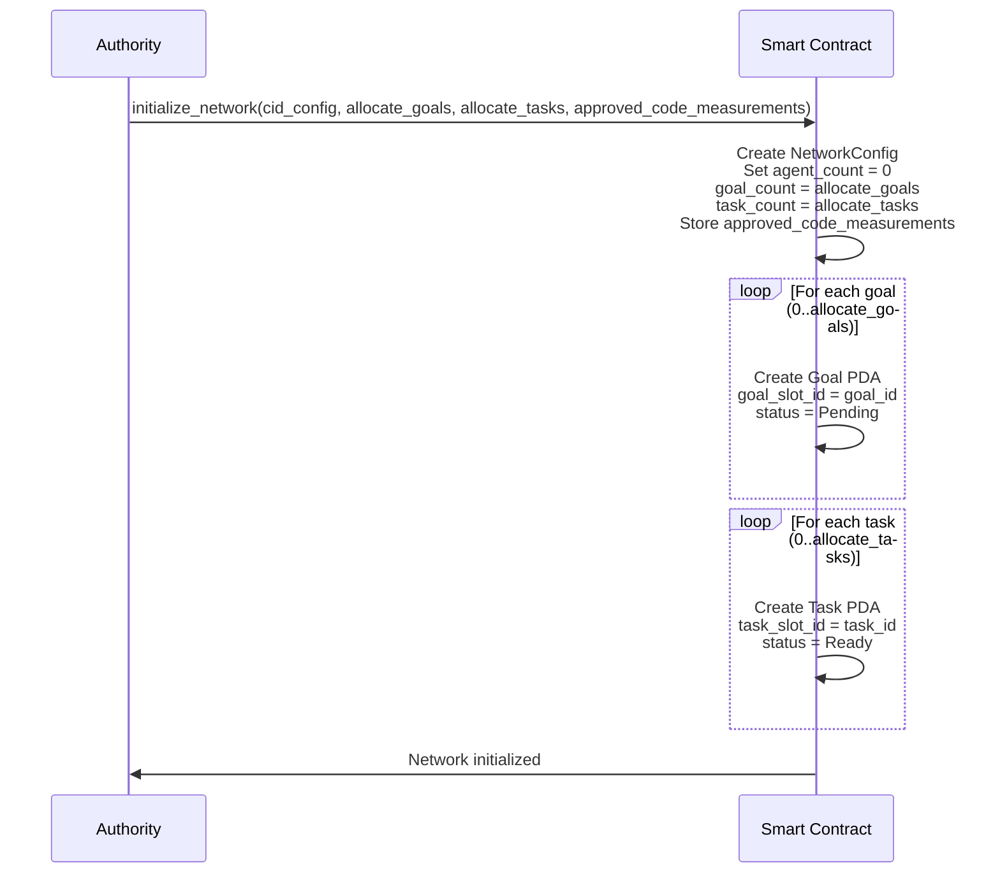

### NodeInfo

Per-node account that stores registration information, TEE attestation data, and node status. Each validator or compute node has its own NodeInfo account.

The NodeInfo PDA stores:
- `node_pubkey`: Public key of the node
- `node_type`: Type of node (Validator or Compute)
- `status`: Current status of the node
- `node_info_cid`: IPFS CID of node metadata (for compute nodes)
- `code_measurement`: TEE code measurement (for validator nodes)
- `tee_signing_pubkey`: TEE signing public key (for validator nodes)
- `bump`: NodeInfo PDA bump seed

Seeds: `["node_info", node_pubkey]`

#### State

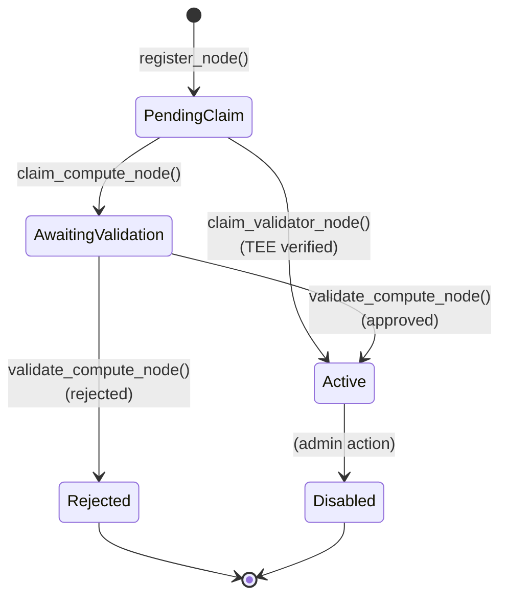

#### Sequence - Compute Node Registration

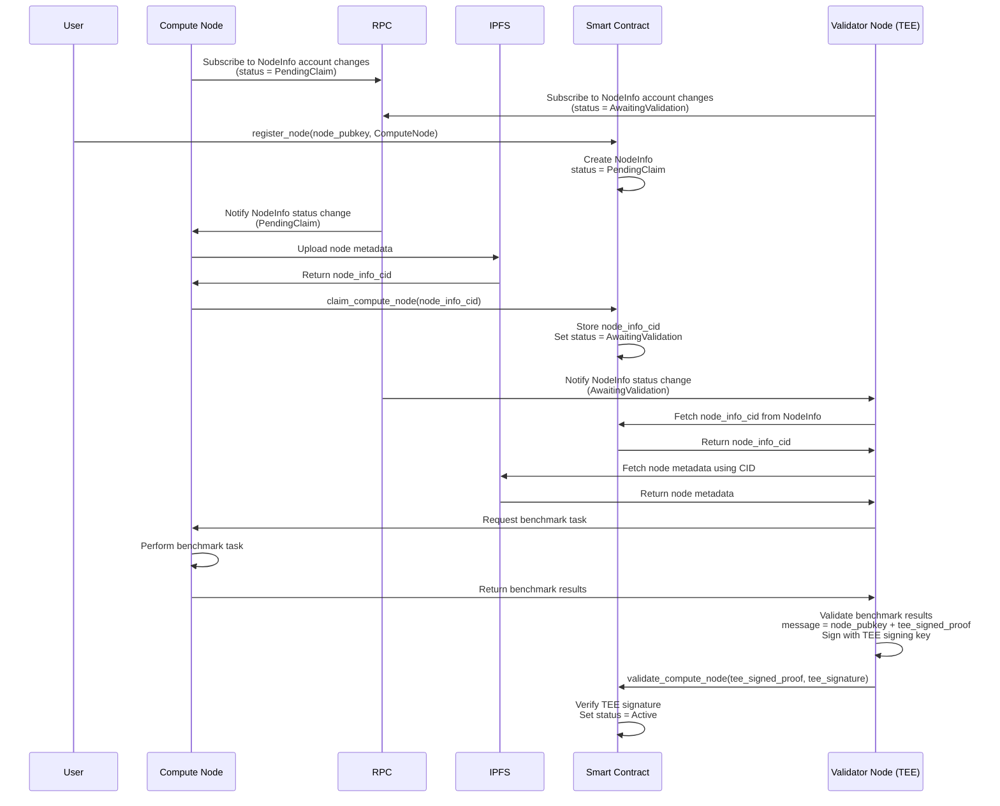

#### Sequence - Validator Node Registration

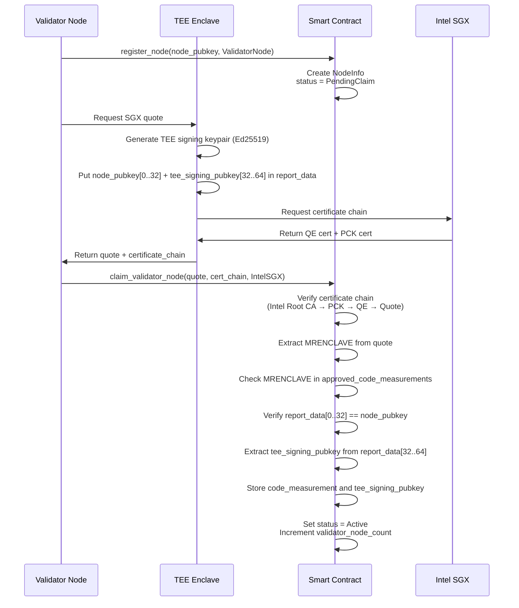

### Agent

Agent account that stores configuration and memory state for AI agents. Agents must be validated by a validator node before becoming active.

The Agent PDA stores:
- `agent_slot_id`: Unique slot identifier for the agent
- `owner`: Agent owner public key
- `agent_config_cid`: IPFS CID of agent configuration
- `agent_memory_cid`: IPFS CID of agent memory state
- `status`: Current status of the agent
- `bump`: Agent PDA bump seed

Seeds: `["agent", network_config, agent_slot_id.to_le_bytes()]`

#### State

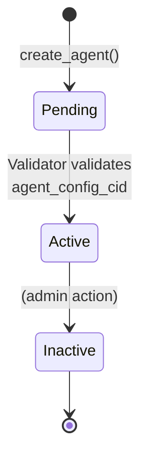

#### Sequence

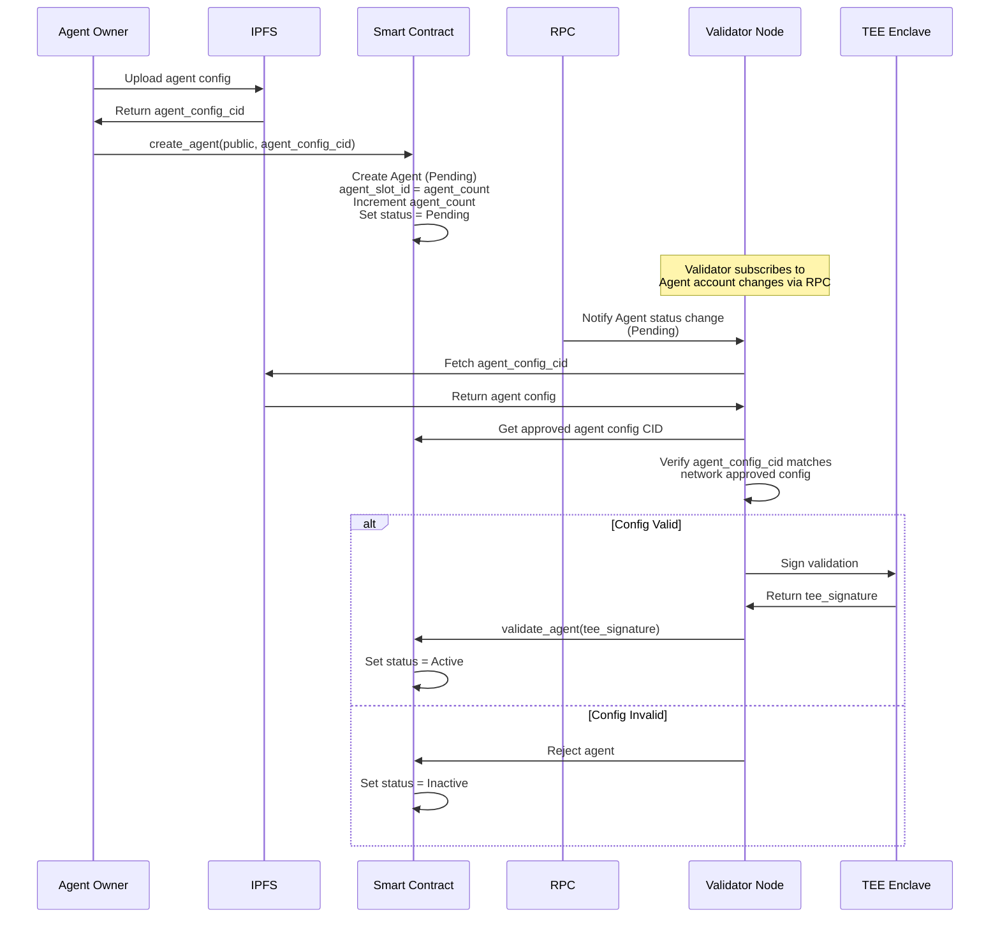

### Goal

Goal account that defines objectives for agents to achieve. Each goal has an associated treasury for payments and tracks iteration progress.

The Goal PDA stores:
- `goal_slot_id`: Unique slot identifier for the goal
- `owner`: Goal owner public key
- `agent`: Associated agent public key
- `status`: Current status of the goal
- `description`: Goal description
- `max_iterations`: Maximum number of iterations
- `current_iteration`: Current iteration count
- `task_index_at_goal_start`: Task index when goal started
- `task_index_at_goal_end`: Task index when goal ended
- `bump`: Goal PDA bump seed

Seeds: `["goal", network_config, goal_slot_id.to_le_bytes()]`

#### State

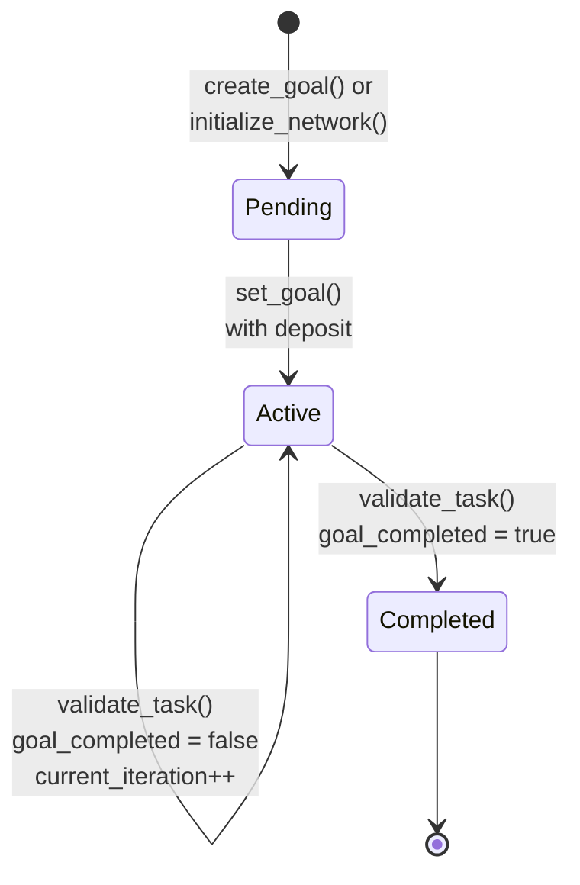

#### Sequence

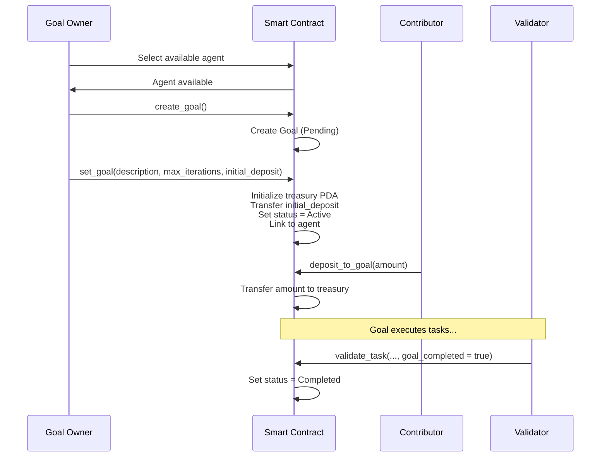

### Task

Task execution account that tracks the lifecycle of individual tasks. Tasks are pre-allocated during network initialization and reused across goal iterations.

The Task PDA stores:
- `task_slot_id`: Unique slot identifier for the task
- `action_type`: Type of action (e.g., LLM)
- `agent`: Associated agent public key
- `status`: Current status of the task
- `compute_node`: Compute node assigned to the task (optional)
- `input_cid`: IPFS CID of task input data (optional)
- `output_cid`: IPFS CID of task output data (optional)
- `chain_proof`: SHA256 hash proof for validation
- `execution_count`: Number of times task has been executed
- `bump`: Task PDA bump seed

Seeds: `["task", network_config, task_slot_id.to_le_bytes()]`

#### State

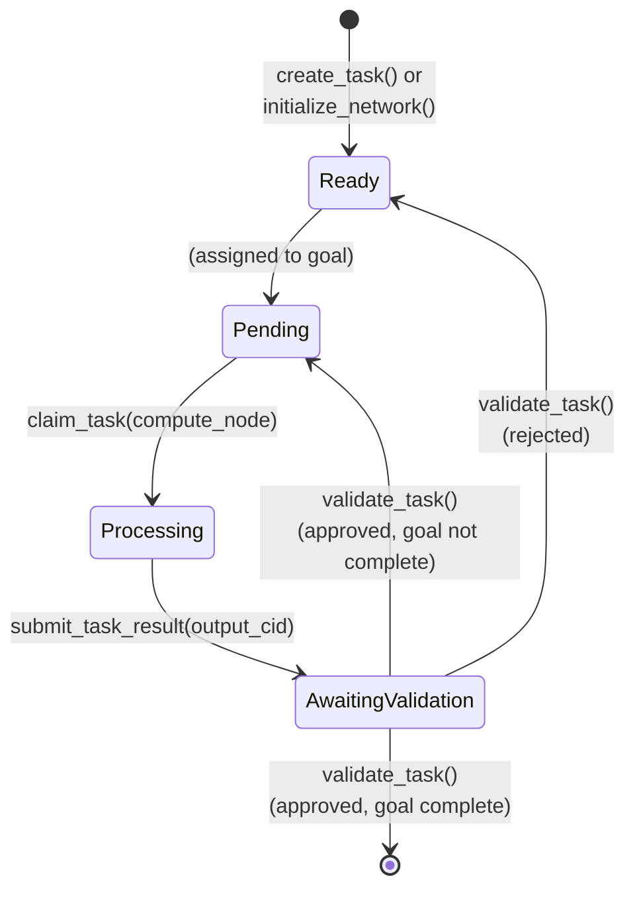

#### Sequence

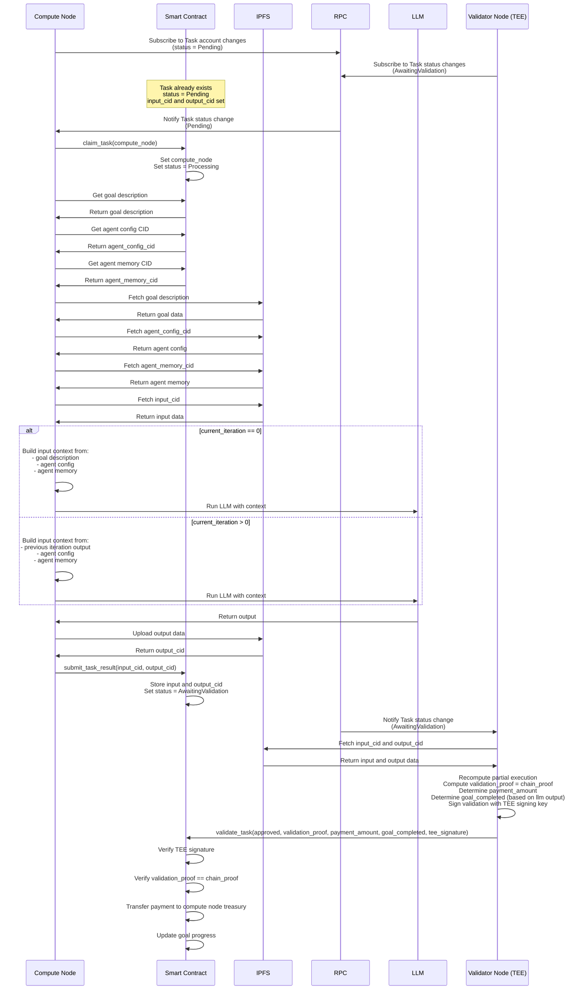

### GoalTreasury

Treasury account that holds SOL for payments to compute nodes. Each goal has an associated treasury PDA that receives deposits and makes payments upon task validation.

The GoalTreasury PDA stores:
- Treasury account balance (SOL)
- `bump`: GoalTreasury PDA bump seed

Seeds: `["treasury", goal]`

#### State

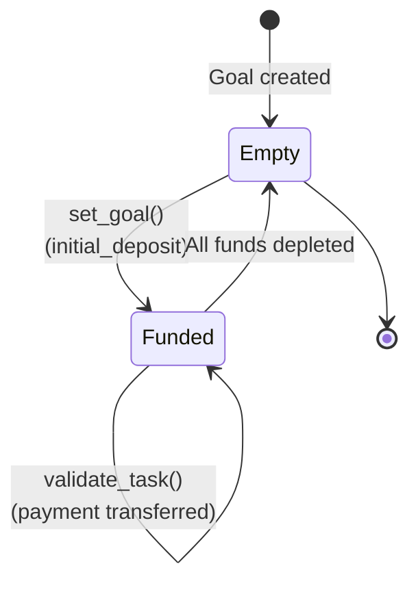

#### Sequence

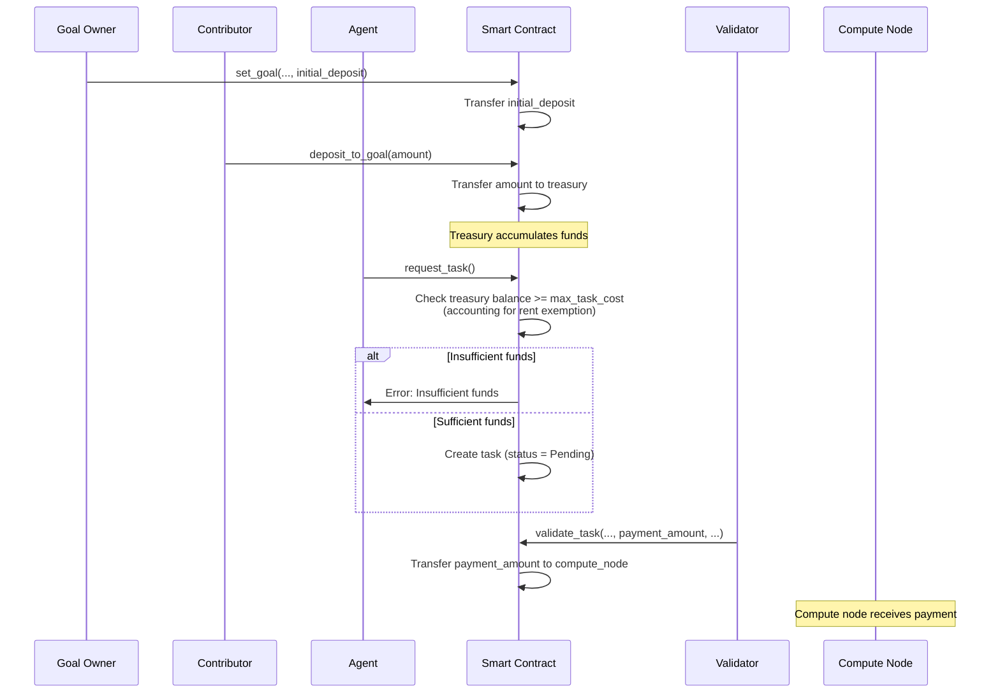

## Security Considerations

### TEE Attestation
- **Validators** must provide valid Intel SGX attestation quotes during registration
- **Code Measurement Whitelist**: Only approved MRENCLAVE values can register as validators
- **Certificate Chain Verification**: Full chain validation from Intel Root CA to quote

### Cryptographic Signatures
- All validator operations are signed using TEE-generated Ed25519 keypairs
- Signatures are verified on-chain before state changes
- TEE signing public key is extracted and stored during attestation

### Data Integrity
- **Chain Proofs**: SHA256 hashes verify data integrity between compute and validation
- **IPFS CIDs**: Content-addressed storage ensures data immutability
- **On-Chain State**: Only critical state and proofs stored on-chain

### Access Control
- Agent ownership enforced through Solana account ownership
- Treasury withdrawals only through validated task completions
- Admin actions clearly separated and auditable
