# Decentralized Autonomous Civilization - Design Document

## Overview

The Decentralized Autonomous Civilization (DAC) is a Solana-based network enabling verifiable AI agent execution with granular payment management. 

## Problem Statement

Existing AI agent systems face several critical challenges:

1. **Lack of Trust**: No verifiable way to ensure AI computations are executed correctly and securely
2. **Centralization**: AI infrastructure is controlled by centralized entities, creating single points of failure and censorship
3. **Payment Friction**: No standardized, automated payment mechanism for compute resources in AI agent systems
4. **No Provenance**: Difficulty in tracking and verifying the full execution history of AI tasks
5. **Resource Allocation**: Inefficient matching of compute resources with AI workloads

## Requirements

### Functional Requirements

1. **Network Initialization**
   - Authority can initialize network with approved TEE code measurements and network configuration
   - Pre-allocation of goal and task slots for efficient resource management

2. **Node Management**
   - **Public Nodes**: Standard nodes that can:
     - Execute public tasks (cannot execute confidential tasks)
     - Validate any tasks (public or confidential) and other public nodes
     - Must pass benchmark validation by multiple validators before becoming active
   - **Confidential Nodes**: Nodes running in TEE (Trusted Execution Environment) that can:
     - Execute both public and confidential tasks (TEE protection for private data)
     - Validate any tasks (public or confidential) and other public nodes
     - Self-approved via TEE attestation (no multi-validator consensus needed)
     - Must prove genuine Intel SGX hardware through attestation
   - **Key Distinction**: Only confidential nodes can **CLAIM/EXECUTE** confidential tasks. However, **any active node** (public or confidential) can **VALIDATE** task execution results.
   - All nodes track validators who approved them
   - Real-time node status tracking and event subscription

3. **Agent Management**
   - Agents must be validated before becoming active
   - Agent configuration stored off-chain (IPFS) with on-chain CID references
   - Agent memory state persistence across task executions

4. **Goal & Task Execution**
   - Goals define objectives with iteration limits and treasury funding
   - Goals can be **public** or **confidential** (for private data processing)
   - **Confidential goals** can only be claimed by **confidential nodes** (TEE environment)
   - **Public goals** can be claimed by any active node (public or confidential)
   - Tasks are pre-allocated and reused across goal iterations
   - Nodes execute tasks using LLM
   - **Any active node** (public or confidential) can validate task execution
   - Multi-validator consensus: tasks require `required_validations` threshold before processing

5. **Payment System**
   - Each goal has an associated vault (SystemAccount PDA)
   - Granular contribution tracking per contributor
   - Contributors can deposit and withdraw at any time before goal completion
   - Immediate payment to compute nodes upon task validation
   - Proportional refund system based on when funds entered
   - Full refunds available on goal cancellation
   - Vault balance checks before computing phase transition

### Non-Functional Requirements

1. **Security**
   - **Confidential nodes** must run in Intel SGX TEE for private data processing
   - TEE attestation required for confidential node registration
   - Code measurement whitelist enforcement for confidential nodes
   - **Public nodes** use standard validation (no TEE required)
   - **Key Distinction**: Only confidential nodes can **CLAIM/EXECUTE** confidential tasks. However, **any active node** (public or confidential) can **VALIDATE** task execution results.
   - Cryptographic signatures for confidential task validations (TEE-based, only confidential nodes can provide)
   - Public task validations use direct parameters (no TEE signature, any active node can validate)
   - SHA256 chain proofs for data integrity
   - Multi-validator consensus prevents single point of failure

2. **Performance**
   - Event-driven architecture using Solana account subscriptions
   - Off-chain data storage (IPFS) to minimize on-chain state
   - Pre-allocated task slots to avoid repeated account creation
   - Immediate payment to compute nodes upon task validation

3. **Scalability**
   - Support for multiple validators and compute nodes
   - Configurable task and goal allocation limits
   - Reusable task accounts across goal iterations

4. **Reliability**
   - Task retry mechanism for failed executions
   - Node status tracking (Active/Disabled/Rejected)
   - Vault balance validation before computing phase
   - Proportional refund system ensures fair cost distribution
   - Goal cancellation with full refunds available

## Design

### Architecture Overview

The system follows a modular architecture with three main layers:

1. **On-Chain Layer (Solana Smart Contract)**
   - Manages all account state and transitions
   - Enforces security rules and payment logic
   - Provides event notifications via account changes

2. **Off-Chain Storage (IPFS)**
   - Stores agent configurations, memory state, and task data
   - Only CIDs stored on-chain for data integrity

3. **Node Layer**
   - **Public Nodes**: Standard nodes that can execute public tasks and validate any tasks/nodes
   - **Confidential Nodes**: Run in TEE (Trusted Execution Environment), can execute both public and confidential tasks, and validate any tasks/nodes
   - **Key Distinction**: Only confidential nodes can **CLAIM/EXECUTE** confidential tasks (TEE protection for private data). However, **any active node** (public or confidential) can **VALIDATE** task execution results and other public nodes.

### Key Design Decisions

1. **Pre-Allocated Task Slots**: Tasks are created during network initialization and reused, avoiding repeated account creation overhead

2. **Event-Driven Architecture**: Nodes subscribe to Solana account changes for real-time notifications, eliminating polling

3. **Separation of Concerns**: Task execution (Compute Nodes) is separate from validation (Validator Nodes)

4. **Dual Validation System**: 
   - **Confidential task validation**: Requires TEE signature (confidential validators)
   - **Public task validation**: Uses direct parameters (any validator)
   - Both require multi-validator consensus (`required_validations` threshold)

5. **Vault-Per-Goal**: Each goal has its own vault SystemAccount PDA for isolated payment management

6. **Immediate Payment**: Compute nodes are paid immediately upon task validation

7. **Proportional Refund System**: Contributors only pay for compute that occurred after their contribution, ensuring fair cost distribution

### Data Flow

1. **Goal Creation & Funding**: Owner creates goal (public or confidential) → initializes vault → optional initial deposit → contributors add funds
2. **Contribution Phase**: Contributors can deposit or withdraw at any time while goal is Active
3. **Computing Phase**: Tasks execute while goal remains Active (funds continue to be available for withdrawals)
4. **Task Execution**: 
   - **Public goals**: Any active node can claim
   - **Confidential goals**: Only confidential nodes can claim (TEE protection)
   - Node executes task with LLM → submits result
5. **Payment**: Multiple validators validate result → when threshold reached → transfers payment immediately to node treasury
6. **Goal Completion**: Validator detects goal completion → when validation threshold reached → goal status set to Ready (can be reused)

## Architecture Specification


### NetworkConfig

Global network configuration account that tracks system-wide statistics and approved code measurements. This is the root account initialized once during network setup.

The NetworkConfig PDA stores:
- `authority`: Public key of the network authority
- `network_config_cid`: IPFS CID of network configuration
- `genesis_hash`: SHA256 hash that initializes all chain proofs (computed as `SHA256("DAC_GENESIS")`)
- `agent_count`: Current number of registered agents
- `goal_count`: Current number of goals
- `task_count`: Current number of tasks
- `validator_node_count`: Current number of active validator nodes
- `compute_node_count`: Current number of active compute nodes
- `required_validations`: Number of validations required for consensus (for agents, nodes, and tasks)
- `approved_code_measurements`: Vector of approved TEE code measurements (max 10)
  - Each entry contains: `measurement` (32 bytes) and `version` (semantic version: major.minor.patch)
  - Newest measurements are always at the beginning (index 0)
  - When adding a new measurement and vector is full, oldest measurement is removed
  - Versions use semantic versioning (major: u16, minor: u16, patch: u16)
- `bump`: NetworkConfig PDA bump seed

Seeds: `["dac_network_config"]`

#### Sequence

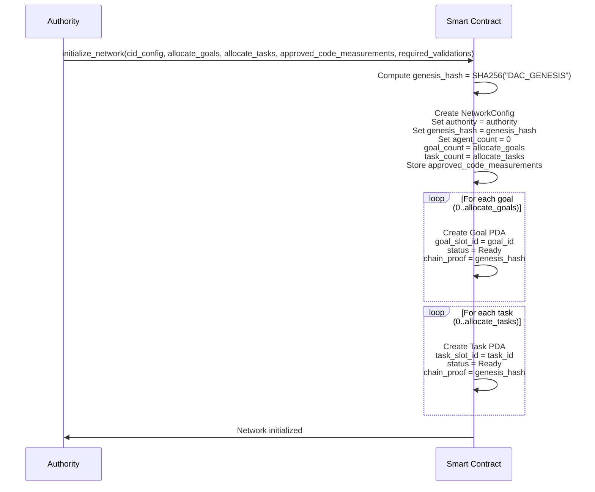

### NodeInfo

Per-node account that stores registration information, TEE attestation data, node status, and reward tracking. Each node (public or confidential) has its own NodeInfo account.

**Node Keypair Generation**: The `node_pubkey` is generated on the server where the node software is launched. Each node instance creates its own keypair for identification and signing operations.

**Node Types:**
- **Public**: Standard nodes that can execute public tasks and validate any tasks
- **Confidential**: Nodes running in TEE (Trusted Execution Environment) for private data processing

The NodeInfo PDA stores:
- `owner`: Public key of the account that registered the node (can be different from node_pubkey)
- `node_pubkey`: Public key of the node (generated on the server where node runs)
- `node_type`: Type of node (Public or Confidential)
- `status`: Current status of the node
- `node_info_cid`: IPFS CID of node metadata (for nodes that execute tasks)
- `code_measurement`: TEE code measurement (for confidential nodes only)
- `tee_signing_pubkey`: TEE signing public key (for confidential nodes only)
- `node_treasury`: Node treasury PDA address (SystemAccount for receiving payments)
- `total_earned`: Cumulative SOL earned by the node
- `total_tasks_completed`: Total number of tasks completed by this node
- `approved_validators`: List of validators who approved this node (max 10)
- `rejected_validators`: List of validators who rejected this node (max 10)
- `bump`: NodeInfo PDA bump seed

Seeds: `["node_info", node_pubkey]`

#### Node Treasury

The node treasury is a **SystemAccount PDA** (not a data account) that receives payments from goal vaults.

Seeds: `["node_treasury", node_info.key()]`

#### State

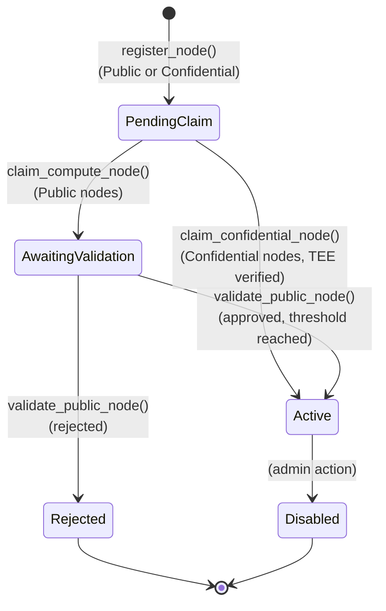

#### Sequence - Public Node Registration

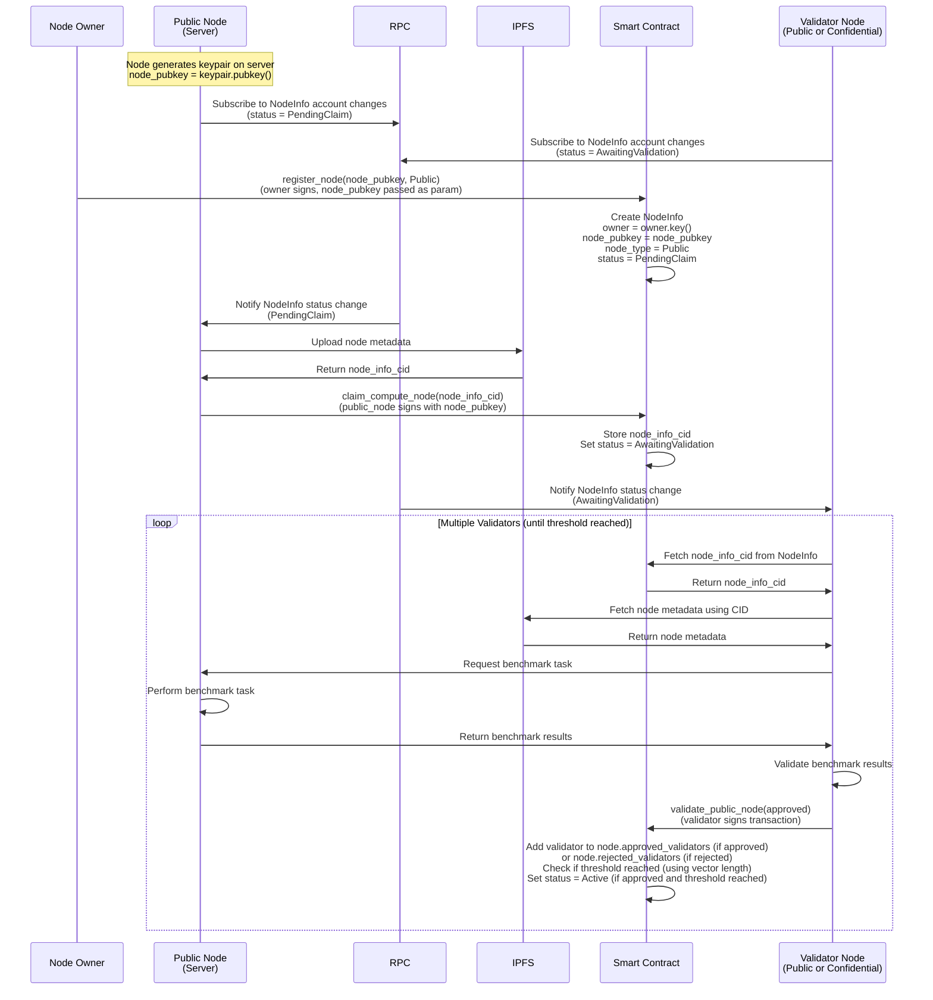

#### Sequence - Confidential Node Registration

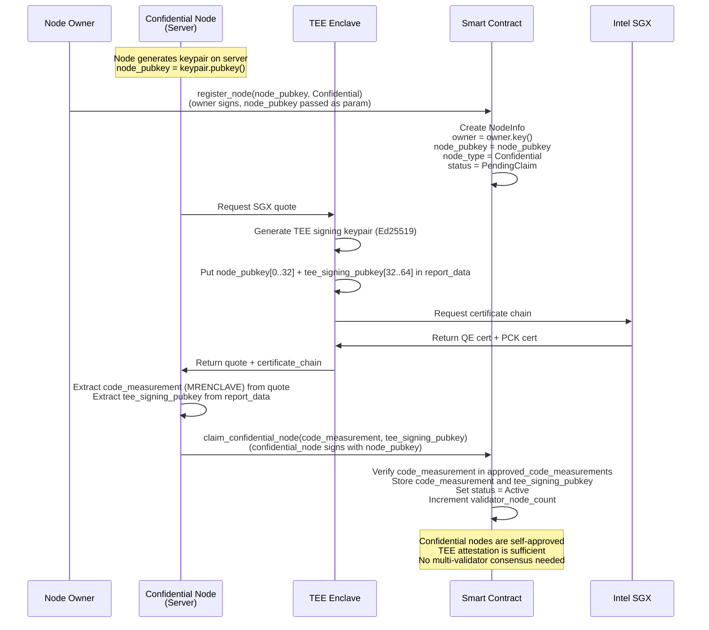

### Agent

Agent account that stores configuration and memory state for AI agents. Agents must be validated by multiple validator nodes before becoming active.

The Agent PDA stores:
- `agent_slot_id`: Unique slot identifier for the agent
- `owner`: Agent owner public key
- `agent_config_cid`: IPFS CID of agent configuration
- `agent_memory_cid`: IPFS CID of agent memory state
- `status`: Current status of the agent
- `approved_validators`: List of validators who approved this agent (max 10)
- `rejected_validators`: List of validators who rejected this agent (max 10)
- `bump`: Agent PDA bump seed

Seeds: `["agent", network_config, agent_slot_id.to_le_bytes()]`

#### State

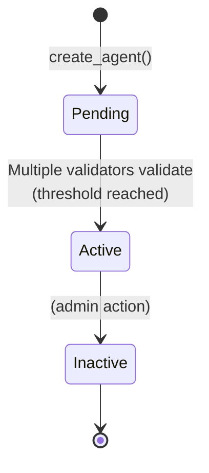

#### Sequence

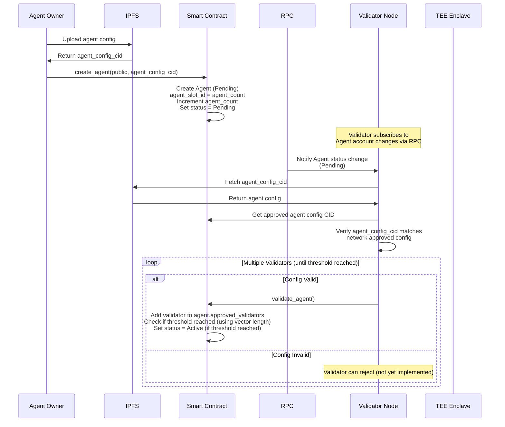

### Goal

Goal account that defines objectives for agents to achieve. Each goal has an associated vault (SystemAccount PDA) for payment management and tracks iteration progress with granular contribution accounting.

The Goal PDA stores:
- `goal_slot_id`: Unique slot identifier for the goal
- `owner`: Goal owner public key (Pubkey::default() if unowned/public, allowing anyone to set the goal)
- `agent`: Associated agent public key
- `task`: Associated task public key
- `status`: Current status of the goal (Ready, Active)
- `specification_cid`: IPFS CID of goal specification (max 128 characters)
- `max_iterations`: Maximum number of iterations
- `current_iteration`: Current iteration count
- `task_index_at_goal_start`: Task index when goal started
- `task_index_at_goal_end`: Task index when goal ended
- `chain_proof`: SHA256 chain proof for data integrity (chained from genesis, updated only after validation)
- `total_shares`: Total shares issued for this goal (share-based accounting)
- `locked_for_tasks`: Total SOL locked for currently processing tasks (max cost locked when claimed, released after validation)
- `is_confidential`: Whether this goal requires confidential (TEE) execution
- `vault_bump`: Vault PDA bump seed
- `bump`: Goal PDA bump seed

**Goal Ownership:**
- Goals can be unowned (owner = Pubkey::default()) - anyone can set these goals
- Goals can be owned (owner = specific pubkey) - only the owner can set these goals
- After goal completion, goals can become unowned (public), allowing reuse by anyone

**Share-Based Accounting:**
- Contributors receive shares when depositing SOL
- Share price calculation:
  - If `total_shares == 0`: share_price = 1.0 (first deposit or all funds withdrawn)
  - Else: share_price = (vault.lamports() - locked_for_tasks - rent_exempt_minimum) / total_shares
  - Note: Rent lamports are excluded from share price calculation (they're for account maintenance, not user deposits)
- Share price automatically adjusts as tasks are paid (vault decreases)
- Withdrawals/refunds calculated as: shares × share_price
- If all funds are withdrawn (total_shares == 0), the next contribution treats it as a fresh start (share_price = 1.0)

Seeds: `["goal", network_config, goal_slot_id.to_le_bytes()]`

#### Goal Vault

The goal vault is a **SystemAccount PDA** (not a data account) that holds SOL for the goal. It has no stored data - the lamport balance is the state.

Seeds: `["goal_vault", goal.key()]`

#### State

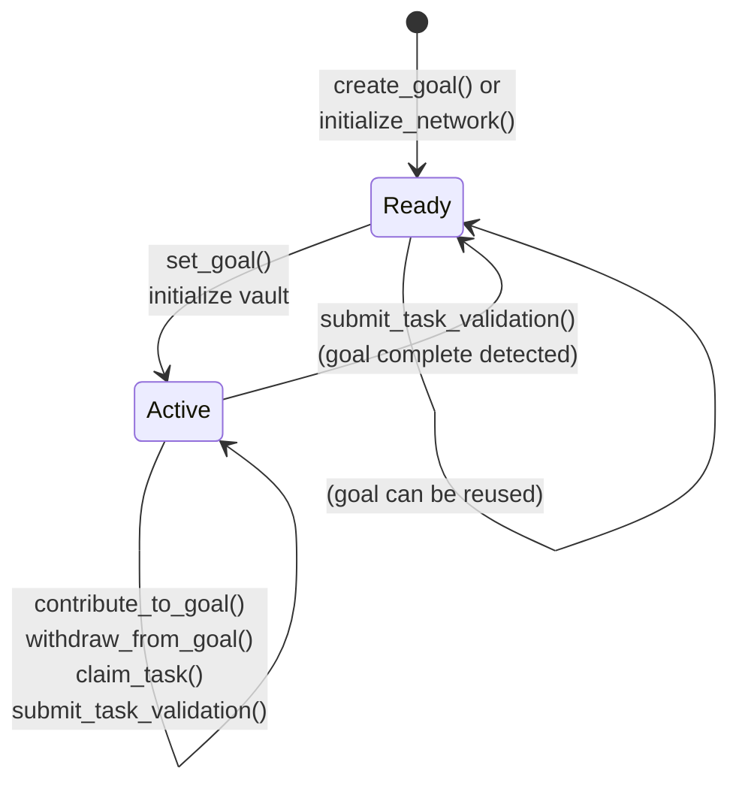

#### Sequence - Goal Lifecycle


### Contribution

Contribution account that tracks individual contributor's share ownership for a specific goal. Each contributor-goal pair has one contribution account.

The Contribution PDA stores:
- `goal`: Goal public key
- `contributor`: Contributor public key
- `shares`: Number of shares owned by this contributor
- `refund_amount`: Final refund amount received after goal completion/cancellation (for history)
- `bump`: Contribution PDA bump seed

**Share Mechanics:**
- When depositing: `shares_to_mint = deposit_amount / share_price`
- When withdrawing: `withdraw_amount = shares_to_burn × share_price`
- Share value automatically decreases as tasks consume vault funds

Seeds: `["contribution", goal.key(), contributor.key()]`


#### Sequence - Contribution & Refund Flow

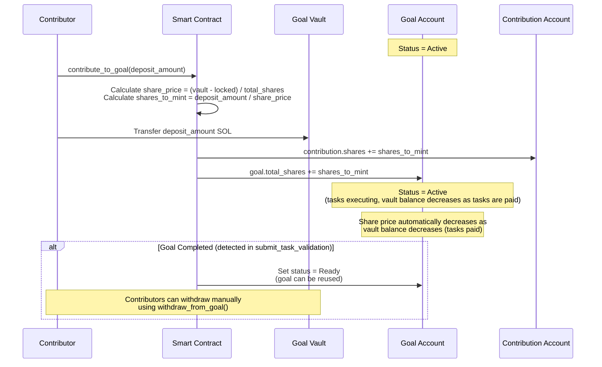

### Task

Task execution account that tracks the lifecycle of individual tasks. Tasks are pre-allocated during network initialization and reused across goal iterations.

The Task PDA stores:
- `task_slot_id`: Unique slot identifier for the task
- `action_type`: Type of action (e.g., LLM)
- `agent`: Associated agent public key
- `status`: Current status of the task
- `compute_node`: Node assigned to the task (optional)
- `input_cid`: IPFS CID of last validated task input data (used in chain_proof)
- `output_cid`: IPFS CID of last validated task output data (used in chain_proof)
- `pending_input_cid`: IPFS CID of task input data awaiting validation (optional)
- `pending_output_cid`: IPFS CID of task output data awaiting validation (optional)
- `next_input_cid`: IPFS CID of input for next iteration (optional)
- `chain_proof`: SHA256 chain proof for validation (chained from genesis, updated only after validation)
- `execution_count`: Number of times task has been executed (includes both validated and rejected attempts, used in chain_proof for unique audit trail)
- `max_task_cost`: Maximum cost locked when task is claimed (actual cost determined at validation)
- `approved_validators`: List of validators who approved this task execution (max 10)
- `rejected_validators`: List of validators who rejected this task execution (max 10)
- `bump`: Task PDA bump seed

**Note:** When a task is claimed, `max_task_cost` is locked. When validated, the actual payment amount (which may be less) is paid to the compute node, and the max lock is released.

Seeds: `["task", network_config, task_slot_id.to_le_bytes()]`

#### State

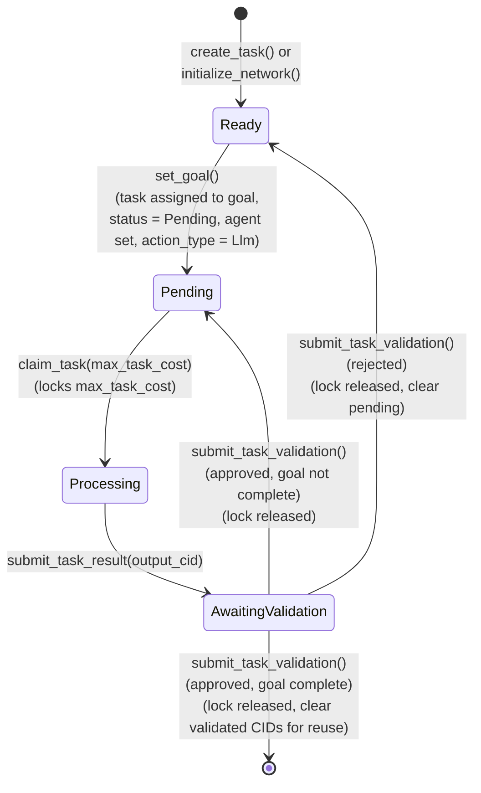

#### Sequence

```mermaid
sequenceDiagram
    participant CN as Compute Node
    participant DAC as Smart Contract
    participant IPFS as IPFS
    participant RPC as RPC
    participant LLM as LLM
    participant VN as Validator Node (TEE)
    
    CN->>RPC: Subscribe to Task account changes<br/>(status = Pending)
    VN->>RPC: Subscribe to Task status changes<br/>(AwaitingValidation)
    
    Note over DAC: Task assigned to goal in set_goal()<br/>status = Pending, agent set, action_type = Llm
    
    RPC->>CN: Notify Task status change<br/>(Pending)
    
    CN->>DAC: claim_task(max_task_cost)
    DAC->>DAC: Verify node_info.status == Active<br/>If goal.is_confidential: Verify node_info.node_type == Confidential<br/>Verify goal.total_shares > 0 (has contributors)<br/>Verify vault.lamports() - goal.locked_for_tasks - rent >= max_task_cost<br/>(available balance sufficient)
    DAC->>DAC: Lock max_task_cost: goal.locked_for_tasks += max_task_cost<br/>Set task.max_task_cost = max_task_cost<br/>Set task.compute_node = node.key()<br/>Set status = Processing<br/>Increment task.execution_count<br/>Reset task.approved_validators = []<br/>Reset task.rejected_validators = []
    Note over DAC: Max cost locked - share price automatically decreases<br/>(locked funds excluded from share price calculation)<br/>Lock released when task validated or fails
    
    CN->>DAC: Fetch task context:<br/>- goal.specification_cid<br/>- agent.agent_config_cid<br/>- agent.agent_memory_cid<br/>- task.input_cid (validated) or pending_input_cid
    DAC->>CN: Return all CIDs
    
    CN->>IPFS: Fetch all required data:<br/>- goal specification<br/>- agent config<br/>- agent memory<br/>- task input
    IPFS->>CN: Return all data
    
    alt current_iteration == 0
        CN->>CN: Build input context from:<br/>- goal description<br/>- agent config<br/>- agent memory<br/>
        CN->>LLM: Run LLM with context
    else current_iteration > 0
        CN->>CN: Build input context from:<br/>- previous iteration output<br/>- agent config<br/>- agent memory<br/>
        CN->>LLM: Run LLM with context
    end
    
    LLM->>CN: Return output
    CN->>IPFS: Upload output data
    IPFS->>CN: Return output_cid
    CN->>DAC: submit_task_result(input_cid, output_cid)
    DAC->>DAC: Store pending_input_cid and pending_output_cid<br/>Set status = AwaitingValidation<br/>(validated input_cid/output_cid preserved)
    
    RPC->>VN: Notify Task status change<br/>(AwaitingValidation)
    
    loop Multiple Validators (until threshold reached)
        alt Goal is Confidential
            VN->>IPFS: Fetch pending_input_cid and pending_output_cid
            IPFS->>VN: Return input and output data
            VN->>VN: Recompute partial execution<br/>Compute validation_proof = SHA256(pending_input_cid + pending_output_cid)<br/>Determine payment_amount<br/>Determine goal_completed (based on llm output)<br/>Create message: SubmitTaskValidationMessage {<br/>  goal_id, task_slot_id, payment_amount,<br/>  validation_proof, approved, goal_completed<br/>}<br/>Sign message with TEE signing key
            VN->>DAC: Transaction with:<br/>1. Ed25519 instruction (signature verification)<br/>2. submit_confidential_task_validation()
            DAC->>DAC: Verify TEE signature<br/>Add validator to task.approved_validators (if approved)<br/>or task.rejected_validators (if rejected)<br/>Check if threshold reached (using vector length)
        else Goal is Public
            VN->>IPFS: Fetch pending_input_cid and pending_output_cid
            IPFS->>VN: Return input and output data
            VN->>VN: Review task execution<br/>Determine payment_amount<br/>Determine approved<br/>Determine goal_completed
            VN->>DAC: submit_public_task_validation(payment_amount, approved, goal_completed)
            DAC->>DAC: Add validator to task.approved_validators (if approved)<br/>or task.rejected_validators (if rejected)<br/>Check if threshold reached (using vector length)
        end
    end
    
    alt Validation Threshold Reached
        DAC->>DAC: Update task chain_proof = SHA256(old_chain_proof + input_cid + output_cid + execution_count)<br/>(uses previous validated input_cid/output_cid)<br/>Move pending to validated: input_cid = pending_input_cid, output_cid = pending_output_cid<br/>Clear pending values<br/>Update goal chain_proof = SHA256(old_goal_proof + task_chain_proof + task_id + iteration)<br/>Release lock: goal.locked_for_tasks -= task.max_task_cost<br/>Transfer payment: vault → node_treasury (payment_amount)<br/>Update node_info.total_earned += payment_amount<br/>Increment node_info.total_tasks_completed<br/>Update goal.current_iteration++
        
        Note over DAC: Share price automatically drops!<br/>Vault decreased by payment_amount
        
        alt Goal Complete (message.goal_completed == true)
            DAC->>DAC: Set goal.status = Ready<br/>(goal can be reused)
        else Goal Not Complete
            DAC->>DAC: Set task.status = Pending<br/>(task ready for next iteration)
        end
    else Validation Rejected (message.approved == false)
        DAC->>DAC: Release lock: goal.locked_for_tasks -= task.max_task_cost<br/>Clear pending: pending_input_cid = None, pending_output_cid = None<br/>Set task.status = Ready<br/>(vault unchanged, share price returns to previous value)
    end
```

## Payment System

### Payment Flow Overview

The DAC payment system implements a three-phase lifecycle with granular contribution tracking and proportional refund mechanisms:

1. **Contribution Phase (Active)**: Contributors deposit funds, can withdraw at any time
2. **Computing Phase (Active)**: Tasks executing, rewards distributing, withdrawals still allowed
3. **Goal Completion (Active → Ready)**: Goal status set to Ready when validator detects completion, allowing goal reuse

### Payment Sequence - Complete Flow

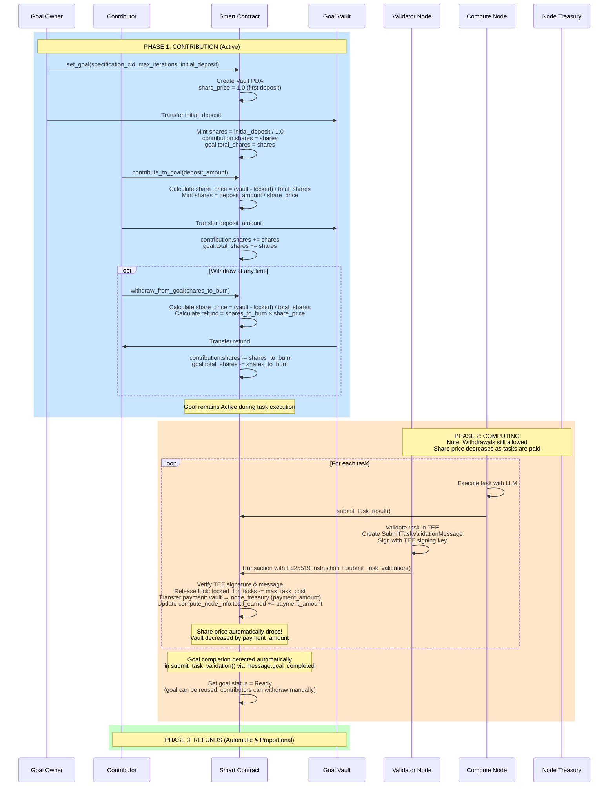

### Share-Based Accounting System

The DAC uses a **share-based accounting system** (similar to mutual funds) to automatically distribute compute costs among contributors proportionally. This eliminates complex per-contributor tracking and enables O(1) cost distribution.

#### Core Concept: The "Mutual Fund" Model

Instead of tracking exact SOL amounts per contributor, the system tracks **shares**:
- When you deposit SOL, you "buy" shares at the current share price
- When you withdraw, you "sell" shares back at the current share price
- The share price changes automatically as the vault balance changes

**Share Price Formula:**
```
share_price = (vault.lamports() - locked_for_tasks) / goal.total_shares
```

When tasks are paid, the vault balance decreases, causing the share price to drop automatically. All contributors' shares lose value proportionally without any per-contributor updates needed.

#### Example Walkthrough

**Step 1: Alice Deposits 100 SOL**
- Vault: 0 → 100 SOL
- Share price: 1.0 (default for first deposit)
- Alice receives: 100 / 1.0 = **100 shares**
- Total shares: 100

**Step 2: Bob Deposits 50 SOL**
- Vault: 100 → 150 SOL
- Share price: 150 / 150 = 1.0
- Bob receives: 50 / 1.0 = **50 shares**
- Total shares: 150

**Step 3: Tasks Execute, Cost 30 SOL**
- Vault: 150 → 120 SOL (30 paid to compute nodes)
- Total shares: 150 (unchanged)
- **New share price: 120 / 150 = 0.8 SOL/share**
- Alice's shares value: 100 × 0.8 = 80 SOL (paid 20 SOL)
- Bob's shares value: 50 × 0.8 = 40 SOL (paid 10 SOL)
- **No account updates needed! Share price adjusted automatically.**

**Step 4: Bob Withdraws Early**
- Bob burns his 50 shares at current price (0.8)
- Refund: 50 × 0.8 = **40 SOL**
- Vault: 120 → 80 SOL
- Total shares: 150 → 100
- New share price: 80 / 100 = 0.8 (unchanged for Alice)

**Step 5: Goal Completes, Alice Gets Refund**
- Alice's shares: 100
- Share price: 0.8
- Refund: 100 × 0.8 = **80 SOL**

**Result:** Alice paid 20 SOL, Bob paid 10 SOL. Perfectly proportional (2:1 ratio) without any complex calculations.


### Payment Mechanism

Nodes are paid immediately when their tasks reach validation threshold. Here's how it works:

**The Process:**

1. **Task Validation**: Multiple validators validate a completed task:
   - **Confidential goals**: Validators use TEE signatures (Ed25519 instruction)
   - **Public goals**: Validators provide direct parameters (payment_amount, approved, goal_completed)
   - Each validator adds to `task.approved_validators` (if approved) or `task.rejected_validators` (if rejected)

2. **Threshold Check**: When `task.approved_validators.len() >= network_config.required_validations` (for approval) or `task.rejected_validators.len() >= network_config.required_validations` (for rejection):
   - Task result is processed (approved or rejected)
   - Payment is transferred immediately from goal vault to node treasury

3. **Immediate Payment**: The payment amount is transferred immediately when threshold is reached

4. **Tracking**: The node's `total_earned` counter is updated with the payment amount, and `total_tasks_completed` is incremented

**Benefits:**
- **Multi-Validator Consensus**: Requires multiple validators before payment (prevents single point of failure)
- **Immediate Payment**: Nodes receive payment as soon as validation threshold is reached
- **Simple**: No batching or accumulation logic needed
- **Transparent**: All payments are tracked in account state for auditing
- **Flexible Validation**: Public goals use simpler validation (no TEE), confidential goals use TEE signatures

### Cancel Goal Flow


## Security Considerations

### TEE Attestation
- **Confidential Nodes** must provide valid Intel SGX attestation quotes during registration
- **Code Measurement Whitelist**: Only approved MRENCLAVE values can register as confidential nodes
- **Certificate Chain Verification**: Full chain validation from Intel Root CA to quote
- **Public Nodes**: No TEE required, validated through benchmark testing by multiple validators


### Data Integrity
- **Hash Chain System**: SHA256 chain proofs provide tamper-proof execution history
  - All chains start from `genesis_hash` (created during network initialization)
  - Task chain: Updated only after validation threshold reached: `SHA256(old_chain_proof + input_cid + output_cid + execution_count)` (uses previous validated input_cid/output_cid, then moves pending to validated)
  - Goal chain: Updated when validated task completes: `SHA256(old_goal_proof + task_chain_proof + task_id + iteration)`
  - Chains continue across reuses - full execution history preserved
  - Off-chain audit: Start from genesis_hash, walk through all validated executions, recompute and verify
- **IPFS CIDs**: Content-addressed storage ensures data immutability
- **On-Chain State**: Only critical state and chain proofs stored on-chain
- **Multi-Validator Consensus**: Tasks require `required_validations` threshold before processing, preventing single point of failure

### Access Control
- Agent ownership enforced through Solana account ownership
- Vault withdrawals only through payments to compute nodes or refunds
- Admin actions clearly separated and auditable

### Payment Security

#### Vault Protection
- **PDA Derivation**: Vault address derived from goal key, preventing unauthorized access
- **Program-Only Transfers**: Only program instructions can modify vault lamports
- **Balance Validation**: All transfers check sufficient balance before execution
- **Rent Exemption**: Vault maintains rent-exempt minimum balance
- **Withdrawal Anytime**: Contributors can withdraw at any time while goal is Active

#### Contribution Accounting
- **Snapshot Mechanism**: Records total_pending_payment at contribution time to prevent gaming refunds
- **Overflow Protection**: All arithmetic uses checked operations (checked_add, checked_sub)
- **Underflow Prevention**: Refund calculations protected with .ok_or(Error::Underflow)
- **Per-Contributor Isolation**: Each contributor has separate PDA account

#### Payment Safety
- **Atomic Operations**: Payment transfer occurs in the same transaction as validation
- **Balance Validation**: All transfers check sufficient vault balance before execution
- **Clear Audit Trail**: All payments are tracked in account state for full auditability

#### State Transition Guards
- **Status Checks**: All operations verify correct goal status
- **Owner Verification**: Critical operations (cancel_goal) require owner signature
- **Automatic Transitions**: 
  - Goal remains Active during task execution
  - Goal transitions from Active → Ready automatically in submit_task_validation() when goal completion is detected

#### Payment Security
- **Fund Locking**: Tasks lock funds on claim (`goal.locked_for_tasks`), preventing withdrawal until validation completes
- **Node Treasury**: PDA-derived from node_info, prevents payment hijacking
- **Refunds**: Automatic on goal completion/cancellation, divided equally among active contributors
- **Immediate Payments**: Payments transferred immediately upon validation, with checked arithmetic to prevent overflow

#### Cryptographic Signatures
- **TEE-Generated Keys**: Confidential node operations signed using Ed25519 keypairs generated in TEE
- **Ed25519 Instruction**: Required before `submit_confidential_task_validation`, extracts signature/pubkey/message via instructions sysvar
- **Pubkey Verification**: Verifies signature created by confidential node's stored TEE signing pubkey (tamper-proof PDA storage)
- **Message**: `SubmitTaskValidationMessage { goal_id, task_slot_id, payment_amount, validation_proof, approved, goal_completed }` - Borsh serialized
- **Public Validation**: No TEE signature required, validators provide parameters directly


#### Goal Status Transition Security
- **Automatic Transitions**: 
  - Goal remains Active during task execution
  - Active → Ready: Automatic when validation threshold reached and validator detects goal completion
- **Owner-Only Operations**: Only cancel_goal() requires owner signature
- **Mitigation**: Owner-only operations verify `ctx.accounts.owner.key() == goal.owner`
- **Status Guards**: Each instruction verifies correct status before allowing operation
- **Validator Authority**: Any active validator (public or confidential) can validate tasks
- **Confidential Goal Protection**: Confidential goals can only be claimed by confidential nodes (TEE protection)


